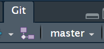

--- 
title: "Learn to use Git and Gitlab"
author: "Larry Zhang"
date: "`r Sys.Date()`"
site: bookdown::bookdown_site
output: bookdown::gitbook
documentclass: book
link-citations: yes
links-as-notes: true
colorlinks: true
---

```{r setup, include=FALSE}
knitr::opts_chunk$set(echo = TRUE)
```

# Preface {-}

This is my attempt to learn to use Git and Gitlab.

# Key concepts

## Local and remote

This is easy: local means your local machine, and remote means Gitlab (or Github, if this is what you use). A nice workflow is: firstly create a repository at Gitlab and then click on the **Clone** button there to have the URL; secondly create a version-controlled (via Git) project at RStudio --- you will need to enter the URL when required, finding the details in *Gitlab basics* (written by Chris Hansen).

Two fine points:

- In *Gitlab basics*, Chris wrote about how to set SSH key. After SSH key is set, the pull/push process becomes easier. 

- Note when the project was just created, RStudio shows "no branch". After first push, Rstudio will show "master".

## Branch

Git is a tool for **version control** and **collaboration**. One important way to implement version control and facilitate collaboration  is to use branches. 
In RStudio, we can create (local and remote) branches by clicking on the button, which is under Git button and has two purple boxes and a white box. After clicking that button, a window will pop up. So, enter a branch name, e.g. Dev, into Branch, then click AddRemote button and enter the branch name for Remote.

How to merge local branches: To do a **merge (locally)**, **git checkout the branch you want to merge INTO**. Then type `git merge <branch>` in Shell where `<branch>` is the branch you want to merge FROM. In RStudio, to check out a branch, just click on a branch name (e.g. 'master') shown under Git button; to start Shell, just click the little arrow button under Git button. 




# Workflow


# References {-}

- Hansen, C. Gitlab basics. https://gitlabstats-prd/SI/r/documentation/gitlab-basics

- Dudler, R. git - the simple guide
https://rogerdudler.github.io/git-guide/

- Version Control With Rstudio And Github
https://aberdeenstudygroup.github.io/studyGroup/lessons/SG-T1-GitHubVersionControl/VersionControl/

 
